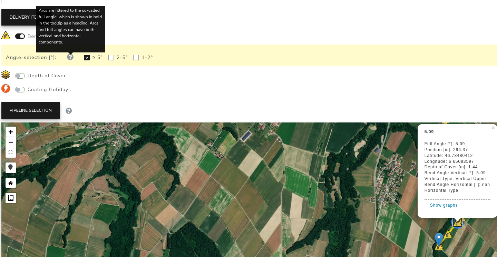
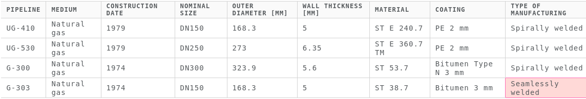
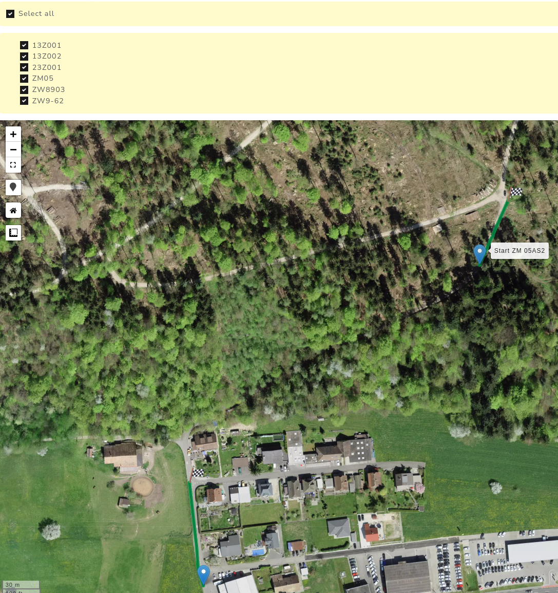

# Weekly Report KW 12

Datum: 01Apr22

## post_processing_v2.py Pathfinder-App Optimization - Vollwinkel reporting

Es werden im post_processing Script nun folgende Spalten generiert:

- full_bends_angel

- h_bend_type

- v_bend_type

- v_bend_angle

- h_bend_angle

Diese Spalten werden in der Pathfinder App nun im tooltip aufgelistet, dadurch ist die suboptimale Darstellung von zwei Bögen (horizontal/vertikal) auf einem Datenpunkt eliminiert und den Kunden steht nun ein vollständiger Bogenparametersatz zur Verfügung, siehe folgende Abbildung. 

Für die SWG muss jedoch der alte Bogen reporting Stil genutzt werden!

## GazNat

Device: Rover

Pipelines: UG410, G303

> https://empit-pathfinder-gaznat.herokuapp.com/
> ID: john126
> PW: matrix126

[x] Geometrie review
[x] Setzen von ACVG Anomalien
[  ] ACVG review/Schulung mit Albin ist Anfang nächster Woche geplant
[x] Erstellung der GazNat app
[x] Alle Markdown files sind nun *up to date*
[x] Leitungsübersicht wurde um die neuen Infos ergänzt
[ ] Versagenswahrscheinlichkeit
[  ] Right of Way
    - [x] UG410 Bilder 
        - [  ] table

## 

## KKG

> https://empit-pathfinder-kkg.herokuapp.com/
> ID: john126
> PW: matrix126

[x] Es werden nun zusammenhängende Pipelines in der App angezeigt, siehe folgende Abbildung.
[x] Bögen >= 5°
[x] Gereviewter, aktueller Datensatz ist nun in der Pathfinder-App
[x] Markdown files sind vollständig *up to date*
[  ] Versagenswahrscheinlichkeit

## OnBoarding

...
